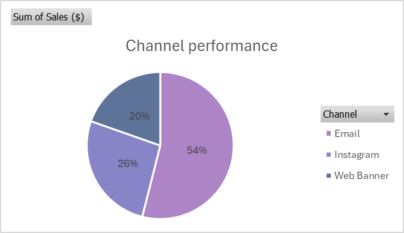
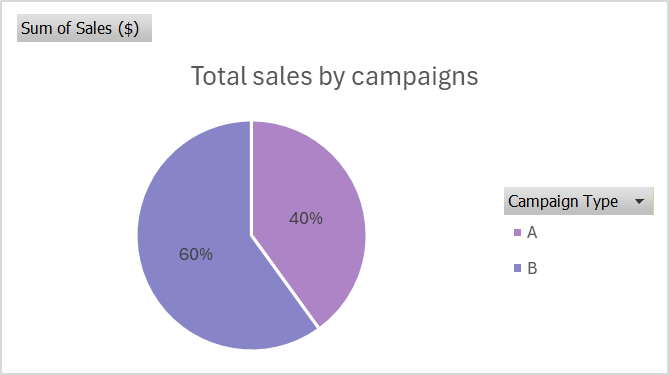
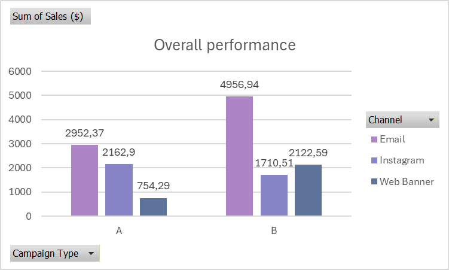
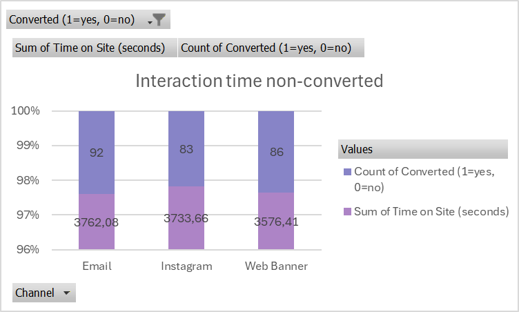
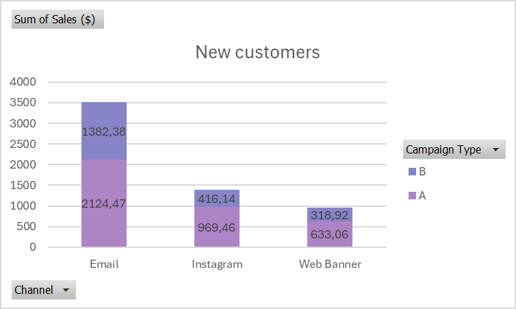

# Marketing Campaigns Performance Analysis - BCGX simulation

Dataset source: [Forage - BCGX simulation](https://www.theforage.com/simulations/bcg/data-for-decision-makers-tod0?reloaded=true)

## Project Overview
This project focuses on analyzing marketing campaign performance for NewCo, with the goal of providing actionable insights to guide strategic investment decisions.  
The analysis evaluates two campaign versions (Campaign A and Campaign B) distributed across multiple channels (Email, Instagram, Web Banner), each with distinct messaging styles and formats. By examining customer engagement, conversion rates, and time on site, the project aims to identify the most effective campaign-channel combinations and inform marketing strategy for the next quarter.

### Campaign Characteristics
* **Campaign A**: Focuses on a friendly, informal tone designed to build trust and engage new customers. Suitable for channels that favor personal and approachable messaging, like Email or Instagram posts.
* **Campaign B**: Uses a professional, sales-oriented tone to drive immediate conversions. Designed for channels where users are ready to purchase or respond to promotional content, such as Email and Web Banners.

## Analysis Approach
The analysis follows a hypothesis-driven, consulting-style approach.  
Starting from the client’s business questions, initial hypotheses were formulated based on campaign formats, channels, and customer segments.  
These hypotheses were then tested using Excel-based analysis and visualizations to generate actionable insights.

## Business Questions
The client aims to understand the effectiveness of its marketing efforts and define future investment priorities.  
Key questions include:
1. Which campaign and channel combination delivered the most value?
2. What drove engagement from new customers?
3. Where should marketing investment be focused next quarter—and why?

## Hypotheses
Before conducting the analysis, the following hypotheses were formulated:
* Instagram, particularly in a 3:4 format with an informal tone, may generate higher engagement due to platform-specific user behavior.
* Email and web banner campaigns may perform better with a more professional and sales-oriented message.
* Different channels may drive value differently for new versus returning customers.

## Analysis & Key Findings

### Revenue Performance  
Email campaigns generated the highest total revenue overall (54%).

### Message Effectiveness  
Campaign B performed best in terms of overall sales, regardless of customer type.

### Channel Performance  
The strongest campaign-channel combination in terms of sales was **Email + Campaign B**.

### Engagement Beyond Sales  
Instagram showed the highest average Time on Site among users who did not convert, suggesting strong top-of-funnel engagement potential.

### New Customer Acquisition  
**Email + Campaign A** was the most effective combination for attracting new customers.

## Strategic Recommendations
Based on the insights:
* Increase investment in **Email + Campaign A** to continue driving new customer acquisition.
* Maintain **Email + Campaign B** to support overall revenue generation.
* Leverage Instagram primarily as an awareness and engagement channel, with potential retargeting strategies.
* Test follow-up email messages to optimize conversion while preserving the trust-building tone.

## Key Takeaways
* Maximizing revenue and acquiring new customers require different channel and message strategies.
* Email remains the most effective channel overall, but message tone significantly impacts outcomes.
* A key trade-off to consider is balancing short-term revenue with long-term new customer growth.